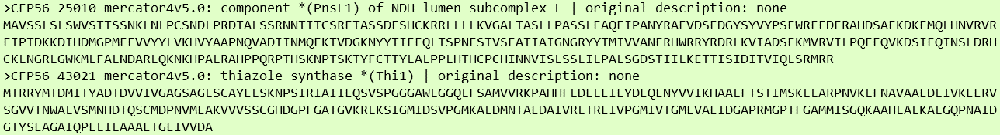

.. _task1-label:

Task 1 - Plant Data Annotation
==============================

To make sense of biological data, we often annotate it with terms that help group and organize it.
Annotated data can be further analysed to gather new insights, such as identifying and/or understanding biological processes of interest.

The `Mercator4 Webtool <https://plabipd.de/portal/mercator4>`_ uses the **MapMan ontology**, a curated vocabulary tailored to annotate plant data. It differs from the more generic Gene Ontology as it describes terms with higher depth and specificity to plant species. A extensive comparison between them is acessible `here <https://www.frontiersin.org/articles/10.3389/fgene.2012.00115/full>`_.

This first task should be performed at the starting point of usage of this tool bundle, as further tasks require **MapMan** annotated data for a more in-depth analysis. If you haven´t already, please download the cork oak data required to follow this use-case in :ref:`download-data-label`. 

Annotating biological data using the MapMan Ontology
----------------------------------------------------

1. Open the `Mercator4 Webtool <https://plabipd.de/portal/mercator4>`_.
2. Select **Sequence Type** → **Protein** (*default*).
3. In **Upload FASTA file**, click **Choose File** and select the ``corkoak_proteins.faa`` file.

.. figure:: images/mercator_input_green.png
   :scale: 100 %

   ``corkoak_proteins.faa`` - example of Mercator4 compatible Input (*FASTA File*)

4. Fill **Job name** with ``corkoak``.
5. Click **Submit Job**.
6. Upon job conclusion, click **Mapping file for MapMan** and **Annotated FASTA file** links to download the respective files.
7. Move the downloaded files into the ``corkoakdata`` folder.
8. Finally, manually extract both .rar files (e.g. with WinRar or WinZip).

The Mercator4 output files should look like the following:

* ``corkoak.fa`` - Example of Mercator4 Output (*FASTA File*)

* ``corkoak.results`` - Example of Mercator4 Output Results (*Text Document*)

**Video Guide:**

.. raw:: html

   <iframe width="560" height="315" src="https://www.youtube.com/embed/KWb1mpFiuOE" title="YouTube video player" frameborder="0" allow="accelerometer; autoplay; clipboard-write; encrypted-media; gyroscope; picture-in-picture; web-share" allowfullscreen></iframe>

|

With the plant annotated data, we are ready to move into :ref:`task2-label`.