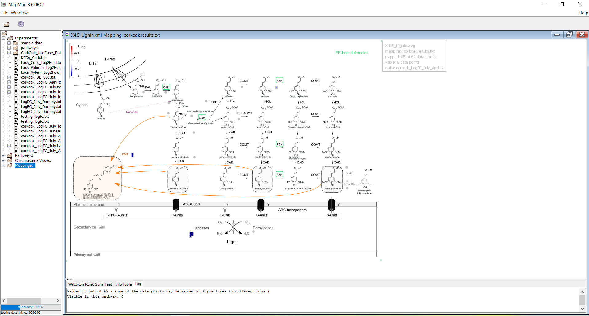
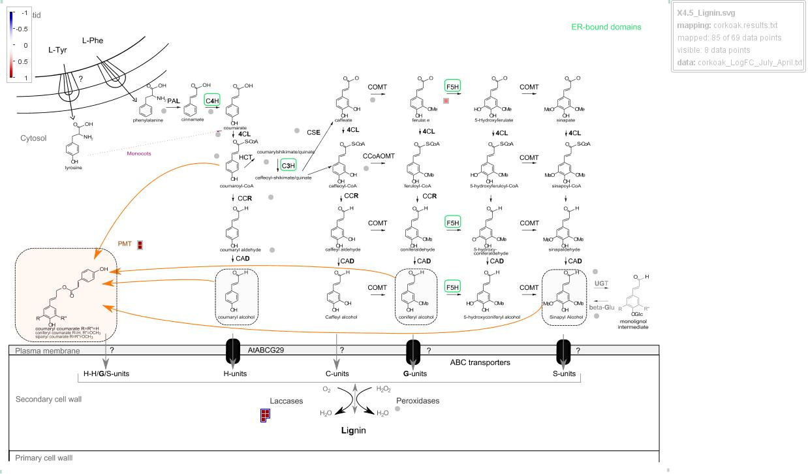

.. _task2-label:

Task 2 - Metabolic Pathway Visualization
========================================

Integrate and visualize a set of biological data (e.g. genes,proteins,enzymes, ...) within metabolic pathways of interest using the `MapMan Desktop App <https://plabipd.de/mapman_main.html>`_.
In this task, the user will handle the set of proteins previously annotated in :ref:`task1-label` and integrate/visualize them within a lignin biosynthesis metabolic pathway.

Integrating annotated cork oak data in a metabolic pathway of interest
----------------------------------------------------------------------

1. Perform the download and installation of the MapMan Desktop App using the **download & installation** intructions within this `guide <https://plabipd.de/mapman_main.html>`_.
2. Launch MapMan, and in the main menu select **Show Pathway to visualize your data in the context of metabolic pathways**.

.. figure:: images/mapman_arrow.png
   :scale: 80 %

3. In the left box, right-click **Experiments** -> **Add Data** -> select the ``corkoak_LogFC_July_April`` file.
4. In the left box, right-click **Mappings** -> **New Mapping** -> **from file**, browse and select the ``corkoak.results`` file (obtained in :ref:`task1-label`) within the ``CorkOak_UseCase_Data-main`` folder. 
5. In the left box, right-click **Pathways** -> **Add Pathway** -> **download**, browse and select the file named ``X4.5_Lignin`` (select the file with the Microsoft Edge HTML Document extension, the XML Document will not work).

.. Warning::
 
   | In the case of error message: service temporarily unavailable, perform these alternative steps:
   | Go to the `Mapman website <https://plabipd.de/mapman_main.html>`_ and under the **diagrams compatible with Mercator4 v.5** section, click to download the ``X4.5 Monolignol biosynthesis`` custom-made diagram, and unzip it (it should extract two separate files).
   | Then, in the left box, right-click **Pathways** -> **Add Pathway** -> **from file**, browse and select the file named ``X4.5_Lignin``

6. In the Pathway Workflow - Choose Pathway box, select the ``X4.5_Lignin`` pathway file.
7. In the Pathway Workflow – Choose Mapping box, select the ``corkoak.results`` mapping file.
8. In the Pathway Workflow – Choose Experimental Data Set, select the ``corkoak_LogFC_July_April`` file.
9. Click **Show Pathway**. It should look like the following:

.. note::

   In MapMan, by default, red color indicates gene downregulation while blue indicates upregulation.

10. Right-click the pathway image and select **Options**. Under the **Coloring Scheme** field, select **+Red Blue-** to invert color mappings.
11. | Download the pathway image by clicking **File** (leftmost corner) -> **Export as Image**, renaming it as ``corkoak_lignin_mapping``.
    | The Output Annotated Pathway should look like the following:

MapMan Output
^^^^^^^^^^^^^

* **Pathway Interpretation**

| The generated pathway illustrates where our query genes are possibly located throughout the several steps of a specified pathway of interest.
|
| In the example shown, some cork oak genes of interest are annotated as **PMTs** and **Laccases**, intervenients in the latter stages of lignin biosynthesis. These genes are colored in red, which also indicates their upregulation during summer, based on the supplied experimental data.
|
| This visualization can help comprehend the possible role of these genes in cork oak and illustrate their pathway-specific regulation during multiple conditions.
|
| In our case, a hint is provided regarding the important upregulation of cork oak genes, such as *CFP56_66243*, *CFP56_46579* and *CFP56_46583*, between others.
|
| These putative **PMTs** and **Laccases**, acting on the latter stages of lignin biosynthesis, are relevant as cork oak is known to undergo higher secondary growth activity during the summer season, including the further development of lignified tissues in the tree stem and bark (cork layer).

.. note::

   | Different visualization options are available by specifying multiple combinations of **Pathways** (obtained from the `MapMan Website <https://plabipd.de/mapman_main.html>`_), **Mappings** (Mercator4 results) and **Experimental Data** (user generated or other publicly availabe data).
   | Nevertheless, in case of no experimental data available, a dummy file can be provided instead (example :ref:`here<dummy_experimental_data_example-label>`).

Video Guide:
^^^^^^^^^^^^

.. raw:: html

   <iframe width="560" height="315" src="https://www.youtube.com/embed/1mbPwHR12RU" title="YouTube video player" frameborder="0" allow="accelerometer; autoplay; clipboard-write; encrypted-media; gyroscope; picture-in-picture; web-share" allowfullscreen></iframe>

|

.. _dummy_experimental_data_example-label:

Dummy Experimental Data Example:

.. csv-table::
   :header: "Gene", "Log2FoldChange"
   :widths: 10, 10

   "geneID1", "1"
   "geneID2", "1"
   "geneID3", "1"
   "...", "..."

| We now have annotated plant data in the context of a specific metabolic pathway!
| For visualization of the annotated data in a dynamic network format, go to the following :ref:`task3-label`.
