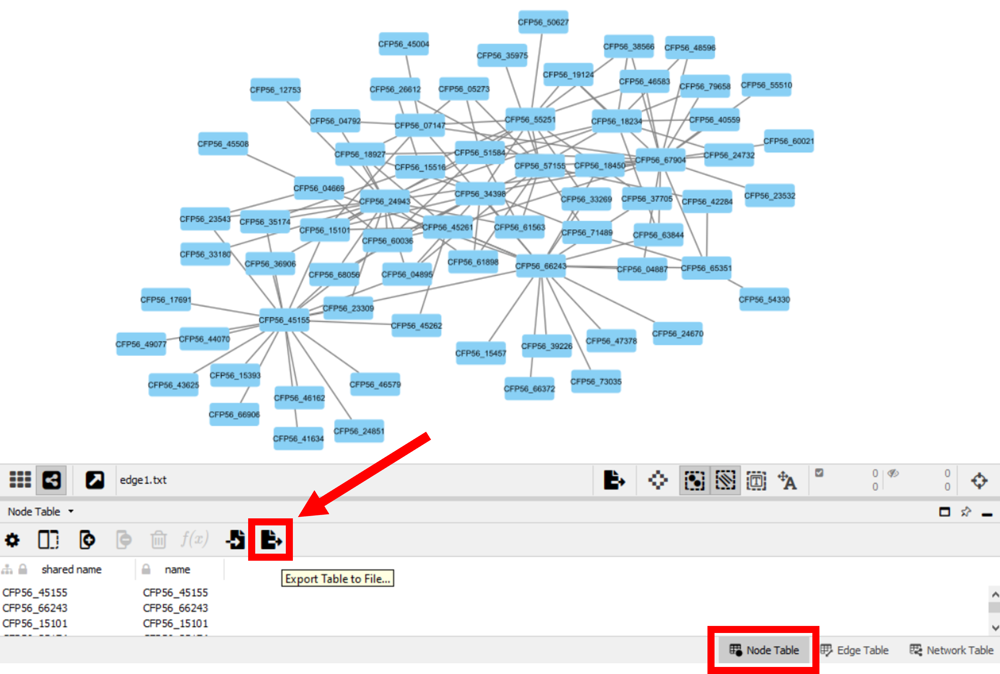
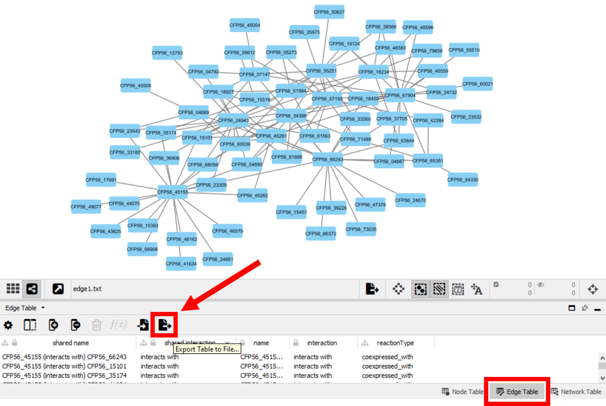

.. _task3-label:

Task 3 - Dynamic Network Visualization
======================================

| `DiNAR <https://nib-si.shinyapps.io/DiNAR/>`_ is a tool used to examine omics datasets in a prior knowledge context. This is achieved through the dynamic representation of biological data  over multiple timepoints or conditions in a network format. 
| The current task will guide the user on how to import and analyse networks into DiNAR and obtain outputs like :ref:`these<dinar_example-label>`.
| To start using DiNAR, two options are provided in this usecase to prepare a gene/protein network with specific requirements:
|
| * :ref:`Option 1<option1-label>` - Using the provided ``Cytoscape_to_Dinar.R`` script to prepare the network.
| * :ref:`Option 2<option2-label>` - Using the DiNAR preprocessing subApp to prepare the network.

.. _option1-label:

Option 1 - Importing a Custom Network into DiNAR with ``Cytoscape_to_Dinar``
----------------------------------------------------------------------------

| This option allows the user to provide simple node and edge tables to import into DiNAR. For example, these can be obtained from Cytoscape (access this :ref:`section<cytoscape-label>` to learn how).
| Additional settings are provided to enrich the network with the ``corkoak.results`` obtained in :ref:`these<task1-label>`, and usefull information from the Ensembl Plants database.

| For this option, the initial node and edge tables should have the following format(s):

* Node Table Example (.csv):

.. csv-table::
   :header: "GeneID"
   :widths: 10

   "CFP56_37705"
   "CFP56_45155"
   "CFP56_55251"
   "..."

.. note::

   This column is mandatory in the first position and must have gene/protein IDs. Additional columns can be present.

* Edge Table Example 1 (.csv):

.. csv-table::
   :header: "GeneID1", "GeneID2", "reactionType"
   :widths: 10, 10, 15

   "CFP56_37705", "CFP56_45155", "coexpressed_with"
   "CFP56_37705", "CFP56_55251", "coexpressed_with"
   "...", "...", "..."

* Edge Table Example 2 (.csv):

.. csv-table::
   :header: "name", "interaction"
   :widths: 20, 15

   "CFP56_37705 (interacts with) CFP56_45155", "interacts with"
   "CFP56_37705 (interacts with) CFP56_55251", "interacts with"
   "...", "..."

.. note::

   The ``corkoak_node.csv`` and ``corkoak_edge.csv``, present in the **CorkOak_UseCase_Data-main** folder, already conform to this format.

.. _startscript-label:

1. | Open the command line (Command Prompt) and run ``Cytoscape_to_Dinar.R``
   | For a detailed usage of this script, go to :ref:`Cytoscape_to_Dinar Usage<script_usage-label>`.

   .. code-block:: R

      #Don't forget to replace the PathToFile section with the Directory where the CorkOak_UseCase_Data-main Folder is located
      Rscript PathToFile/Cytoscape_to_Dinar.R -n corkoak_node.csv -e corkoak_edge.csv -c corkoak.results -o corkoak_dinar

After running the script, the output files should look like the following:

* DiNAR Ready Node Table ``corkoak_dinar_node.txt``:

.. csv-table::
   :header: "GeneID", "shortName", "shortDescription", "MapManBIN", "clusterID", "x", "y", "clusterSimplifiedNodeDegree", "expressed"
   :widths: 10, 15, 20, 20, 10, 20, 20, 10, 10

   "CFP56_37705", "TPX2", "protein TPX2", "35.2_not classified", "1", "13.2944396706271", "13.9080090717365", "2", "1"
   "CFP56_45155", "NAC43", "NAC domain-containing protein 43", "28.2.1.11.2_transcriptional regulator \*(NST1/NST2)", "1", "6.39534301750403", "20.3626647889864", "20", "1"
   "CFP56_55251", "COBRA4", "COBRA-like protein 4", "21.1.2.2_regulatory protein \*(COB) of cellulose-hemicellulose network assembly", "1", "22.5121051761507", "11.7050783234164", "12", "1"
   "...", "...", "...", "...", "...", "...", "...", "...", "..."

* DiNAR Ready Edge Table ``corkoak_dinar_edge.txt``:

.. csv-table::
   :header: "GeneID1", "GeneID2", "reactionType", "clusterID_geneID1", "clusterID_geneID2", "clusterSimplifiedNodeDegree_geneID1", "clusterSimplifiedNodeDegree_geneID2", "exists"
   :widths: 10, 10, 15, 10, 10, 10, 10, 10

   "CFP56_37705", "CFP56_45155", "coexpressed_with", "1", "1", "2", "20", "1"
   "CFP56_37705", "CFP56_55251", "coexpressed_with", "1", "1", "2", "12", "1"
   "...", "...", "...", "...", "...", "...", "...", "..."

With the tables ready, jump to the following :ref:`Main DiNAR section<main_dinar-label>`.

.. _option2-label:

Option 2 - Preparing a Custom Network into DiNaR (from other sources)
---------------------------------------------------------------------

Alternatively, to import a custom network into `DiNAR <https://nib-si.shinyapps.io/DiNAR/>`_ and avoid the ``Cytoscape_to_Dinar.R`` script, a node and edge tables should be supplied following a specified tabular structure, which must be firstly processed with the `DiNaR preprocessing subApp <https://nib-si.shinyapps.io/pre-processing/>`_. The table formats necessary for this option are the following:

* Node Table Example (before DiNAR preprocessing):

.. csv-table::
   :header: "GeneID", "shortName", "shortDescription", "MapManBin"
   :widths: 10, 10, 10, 10

   "CFP56_37705", "\-", "\-", "\-"
   "CFP56_45155", "\-", "\-", "\-"
   "CFP56_55251", "\-", "\-", "\-"
   "...", "...", "...", "..."

| The first column is the only one required to be filled (either with gene or protein IDs). The other columns are required but may be left empty (using "-").
| Additional columns can also be present.

* Edge Table Example (before DiNAR preprocessing):

.. csv-table::
   :header: "GeneID1", "GeneID2", "reactionType"
   :widths: 10, 10, 15

   "CFP56_37705", "CFP56_45155", "coexpressed_with"
   "CFP56_37705", "CFP56_55251", "coexpressed_with"
   "...", "...", "..."

1. Open the `DiNaR preprocessing subApp <https://nib-si.shinyapps.io/pre-processing/>`_ and select the **tables** option tab
2. Click **Choose Nodes File** and select a input node table
3. Click **Choose Edges File** and select a input edge table
4. In the Nodes Tab, click download (button under the plot visualization). It should look like the following:

.. csv-table::
   :header: "GeneID", "shortName", "shortDescription", "MapManBIN", "clusterID", "x", "y", "clusterSimplifiedNodeDegree", "expressed" 
   :widths: 10, 15, 20, 20, 10, 10, 10, 10,10

   "CFP56_37705", "\-", "\-", "\-", "1", "13.2944396706271", "13.9080090717365", "2", "1"
   "CFP56_45155", "\-", "\-", "\-", "1", "6.39534301750403", "20.3626647889864", "20", "1"
   "CFP56_55251", "\-", "\-", "\-", "1", "22.5121051761507", "11.7050783234164", "12", "1"
   "...", "...", "...", "...", "...", "...", "...", "...", "..."

5. In the Edges Tab, click download (button under the plot visualization). It should look like the following:

.. csv-table::
   :header: "GeneID1", "GeneID2", "reactionType", "clusterID_geneID1", "clusterID_geneID2", "clusterSimplifiedNodeDegree_geneID1", "clusterSimplifiedNodeDegree_geneID2", "exists"
   :widths: 10, 10, 15, 10, 10, 10, 10, 10

   "CFP56_37705", "CFP56_45155", "coexpressed_with", "1", "1", "2", "20", "1"
   "CFP56_37705", "CFP56_55251", "coexpressed_with", "1", "1", "2", "12", "1"
   "...", "...", "...", "...", "...", "...", "...", "..."

**Video guide for** `DiNaR preprocessing subApp <https://nib-si.shinyapps.io/pre-processing/>`_
^^^^^^^^^^^^^^^^^^^^^^^^^^^^^^^^^^^^^^^^^^^^^^^^^^^^^^^^^^^^^^^^^^^^^^^^^^^^^^^^^^^^^^^^^^^^^^^

.. raw:: html

   <iframe width="560" height="315" src="https://www.youtube.com/embed/KWb1mpFiuOE" title="YouTube video player" frameborder="0" allow="accelerometer; autoplay; clipboard-write; encrypted-media; gyroscope; picture-in-picture; web-share" allowfullscreen></iframe>

|

With the tables ready with this alternative method, we can then import them into DiNAR.

.. _main_dinar-label:

|

Importing a Custom Network into the Main DiNaR App
--------------------------------------------------

1. Go to the `DiNaR App <https://nib-si.shinyapps.io/DiNAR/>`_
2. In **select network**, choose **Custom network**
3. In **Upload nodes table**, select the ``corkoak_dinar_node.txt`` file
4. In **Upload edges table**, select the ``corkoak_dinar_edge.txt`` file
5. In **Upload Experimental data files**, select the ``corkoak_LogFC_April.txt``, ``corkoak_LogFC_June.txt`` and ``corkoak_LogFC_July.txt`` files
6. Confirm columns containing gene IDs (geneID), statistical significance (adj.P.Val) and the logFC values (LogFC\_"month")
7. Click **Proceed!**

Exploring DiNaR network visualization options
^^^^^^^^^^^^^^^^^^^^^^^^^^^^^^^^^^^^^^^^^^^^^

1. Click the **Cluster Information** Tab, and select the **MapMan BINs** option

| This image highlights the most populated Bins throughout the Input Network, with the X - cell wall being the most prevalent for our example.
| Search and Filtering options under the bin and description columns can help identify processes of interest occurrying in biological networks.

Creating a dynamic network visualization
^^^^^^^^^^^^^^^^^^^^^^^^^^^^^^^^^^^^^^^^

.. note::

   Larger amounts of experimental data allows the user to create longer and richer dynamic network visualizations in DiNAR.

1. Click the Differential expression per cluster Tab, and select the Dynamic-animatoR option
2. Scroll down and, under the **Select speed** option, click on the video speed **1**

.. note::

   Different speed settings can be used to obtained visualizations which go faster (speed **1**) or slower (speed **0.1**) throughout multiple conditions/timepoints.

3. Click **Create dynamic.html**
4. After a couple seconds (depending on network size), click **Download dynamic.html**
5. Open the .html file and click the |start| starting video symbol

* Cork Oak Dynamic Network Visualization:

.. raw:: html

   <iframe width="560" height="315" src="../_static/SeasonalGrowth.html" frameborder="0" allow="accelerometer; autoplay; clipboard-write; encrypted-media; gyroscope; picture-in-picture; web-share" allowfullscreen></iframe>

|

| It is clear to notice, through the visualization of the generated video, that all cork oak genes present in the example network have a concerted increase in gene expression towards the month of July (summer). Together with the information inferred in the previous task, these observations highlight a steady gene upregulation in cork oak as this species seasonal growth includes gene upregulation towards lignin biosynthesis and tree growth processes during summer.

| Larger and more complex networks, with mixing gene downregulation and upregulation, and additional curated data, can be visualized in DiNAR to observe time-specific phenomena in a clear and intuitive manner.

**Video guide for** `DiNaR App <https://nib-si.shinyapps.io/DiNAR/>`_
^^^^^^^^^^^^^^^^^^^^^^^^^^^^^^^^^^^^^^^^^^^^^^^^^^^^^^^^^^^^^^^^^^^^^

.. raw:: html

   <iframe width="560" height="315" src="https://www.youtube.com/embed/KWb1mpFiuOE" title="YouTube video player" frameborder="0" allow="accelerometer; autoplay; clipboard-write; encrypted-media; gyroscope; picture-in-picture; web-share" allowfullscreen></iframe>

.. _cytoscape-label:

|

Now, if ready, the user can move into the next and final (:ref:`task4-label`), which will help in the retrieval of information from the Ensembl Plants database from the command line.

Getting Node and Edge Tables from Cytoscape
^^^^^^^^^^^^^^^^^^^^^^^^^^^^^^^^^^^^^^^^^^^

`Cytoscape <https://cytoscape.org/>`_ is a widely used tool for network analysis and visualization. This section will guide the user on how to obtain node/edge tables to be imported into DiNAR using the ``Cytoscape_to_Dinar.R`` script.

1. In Cytoscape, select the desired network
2. Click the **Node Table** tab
3. Select the **Export Table to File...** option, saving it in the default (.csv) format

4. Click the **Edge Table** tab
5. Select the **Export Table to File...** option, saving it in the default (.csv) format

.. note::

   Both node and edge tables can be retrieved from several databases or retrieved from other network visualization tools, as long the structure remains DiNAR compatible.

.. _script_usage-label:

| With these tables from Cytoscape, the user can resume the workflow to prepare and import them into DiNAR :ref:`here<startscript-label>`.
|

Rscript Usage:
^^^^^^^^^^^^^^

   .. code-block:: R

      Rscript PathToFile/Cytoscape_to_Dinar.R [-n] node_table.csv [-e] edge_table -c corkoak.results -e species_name -o output_name

   * ``[-n] node table`` - Input a Node Table (.csv, comma-separated)
   * ``[-e] edge table`` - Input a Edge Table (.csv, comma-separated)
   * ``[-c] custom annotation`` - Input gene/protein annotations obtained in Mercator4 / mercator.results (optional)
   * ``[-e] ensemblplants`` - Retrieve short names, short descriptions and orthologs from the Ensembl Plants database (optional)
   * ``[-o] output`` - Specify a name for the output node and edge tables

.. warning::

   Do not forget to specify the path for the directory where this script is located (CorkOak_UseCase_Data-main).
   This should also be the folder with the corkoak_node.csv, corkoak_edge.csv and corkoak.results.txt files.

.. _dinar_example-label:

|

DiNAR Output Examples
^^^^^^^^^^^^^^^^^^^^^

The following visualizations were obtained from a *Arabidopsis thaliana* network showcasing gene expression in multiple timepoints after *Pseudomonas syringae* infection (described `here <https://www.ncbi.nlm.nih.gov/pmc/articles/PMC6117943/>`_).

* Example 1 - Interactive Visualization Option (.html format)

This option allows the user to click nodes and edges of the network to check their summarized information, and highlights the expression tendencies of specific genes throughtout the course of infection response.

.. raw:: html

   <iframe width="700" height="400" src="../_static/LKN_QuickAppTest(Ath123)_clu_1_deg_0_tp_1NDTV.html" frameborder="0" allow="accelerometer; autoplay; clipboard-write; encrypted-media; gyroscope; picture-in-picture; web-share" allowfullscreen></iframe>

|

* Example 2 - Video Option (.mp4 format)

.. raw:: html

   <iframe width="560" height="315" src="https://www.youtube.com/embed/f-mhm-MqgSU" title="YouTube video player" frameborder="0" allow="accelerometer; autoplay; clipboard-write; encrypted-media; gyroscope; picture-in-picture; web-share" allowfullscreen></iframe>

|

| This concludes Task 3 of the current usecase. 
| The next and final :ref:`task4-label` will guide the user on how to retrieve information from the Ensembl Plants database, independently of the ``Cytoscape_to_Dinar.R`` script.
|